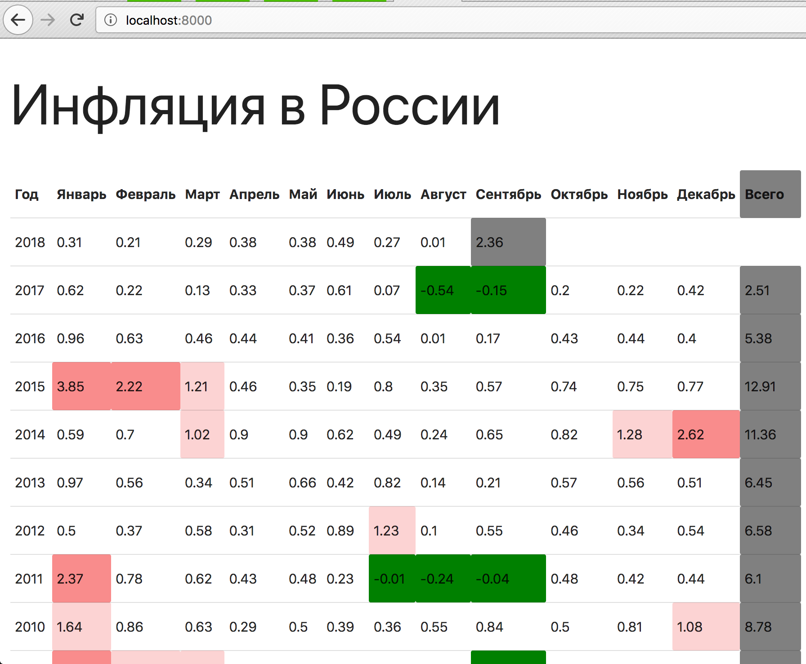
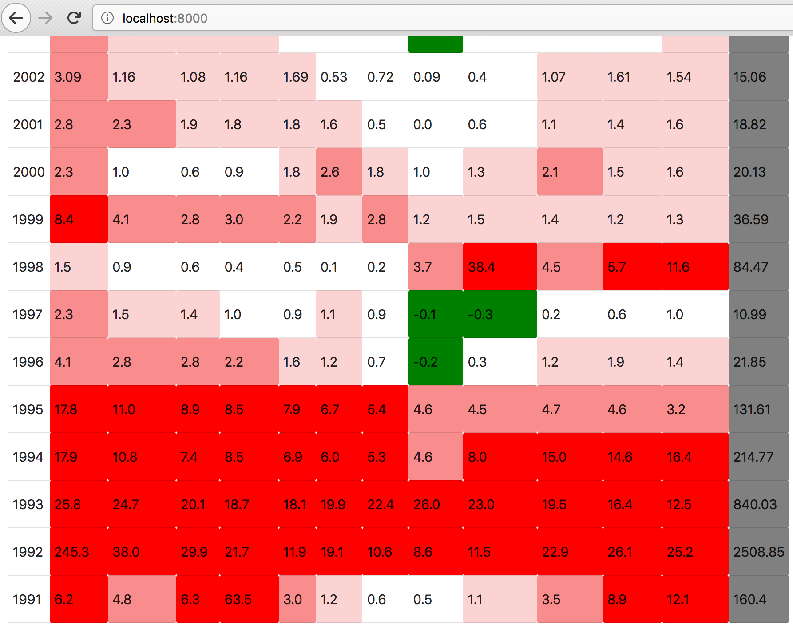

# Построение таблицы

Сравнительная таблица динамики инфляции в РФ. 

Данные по инфляции в csv-файле. Приложение, выводит размер инфляции по годам и месяцам в процентах и отображает общую инфляцию за год.

## Отображение в таблице:

- Таблица состоит из столбцов: "Год", перечисление месяцев, "Всего". Суммарно 14 столбцов.

- Таблица с суммарной величиной закрашена в серый цвет.

- Если инфляция за месяц была отрицательной (дефляция), ячейка закрашена в зеленый. Если значение инфляции превысило 1%, то в красный. Реализована визуальная градация красного: от 1% до 2%, от 2% до 5%, от 5% и более.

- Если данных за месяц нет, выводится прочерк.

## Примеры таблицы:

#### Пример 1

#### Пример 2

